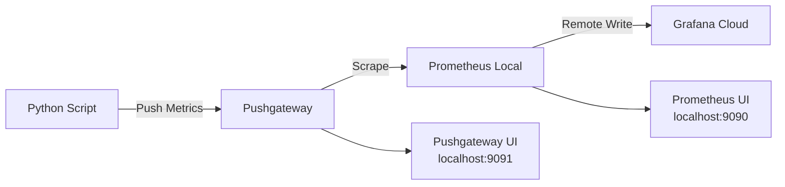

# Prometheus + Pushgateway + Grafana Cloud Integration

Este documento explica paso a paso cómo configurar un entorno local con **Prometheus**, **Pushgateway** y un **script Python** para enviar métricas personalizadas hacia **Grafana Cloud**.

---

## 🧩 Arquitectura General

```
[Python Script] → [Pushgateway] → [Prometheus Local] → [Grafana Cloud]
```

El flujo es el siguiente:

1. El script en Python genera métricas y las envía al **Pushgateway** local.
2. **Prometheus** realiza un scrape de las métricas del Pushgateway.
3. **Prometheus** reenvía esas métricas a **Grafana Cloud** usando `remote_write`.

---

## 🛠️ Archivos del Proyecto

### 1️⃣ `docker-compose.yml`

```yaml
version: '3.8'

services:
  prometheus:
    image: prom/prometheus:latest
    container_name: prometheus
    command:
      - '--config.file=/etc/prometheus/prometheus.yml'
      - '--storage.tsdb.path=/prometheus'
      - '--web.enable-lifecycle'
    volumes:
      # Archivo de configuración Prometheus
      - /root/monitoreo-observabilidad/prom/config/prometheus.yml:/etc/prometheus/prometheus.yml
      # Persistencia de datos
      - prometheus_data:/prometheus
    ports:
      - "9090:9090"
    depends_on:
      - pushgateway
      - node-exporter
    networks:
      - prom-net

  pushgateway:
    image: prom/pushgateway:latest
    container_name: pushgateway
    ports:
      - "9091:9091"
    networks:
      - prom-net

  node-exporter:
    image: prom/node-exporter:latest
    container_name: node-exporter
    ports:
      - "9100:9100"
    networks:
      - prom-net

networks:
  prom-net:
    driver: bridge

volumes:
  prometheus_data:
```

### 2️⃣ `prometheus.yml`

```yaml
global:
  scrape_interval: 15s

scrape_configs:
  - job_name: "prometheus"
    static_configs:
      - targets: ["localhost:9090"]

  - job_name: "pushgateway"
    static_configs:
      - targets: ["pushgateway:9091"]

remote_write:
  - url: "<PROMETHEYUS_URL>"
    basic_auth:
      username: "<GRAFANA_INSTANCE_ID>"
      password: "<GRAFANA_API_KEY>"
```

> 🔑 Reemplaza `<GRAFANA_INSTANCE_ID>` y `<GRAFANA_API_KEY>` con tus credenciales reales de Grafana Cloud.

### 3️⃣ `push_metrics.py`

Instala previamente las siguientes dependencias de python

```
pip3 install prometheus-client
```

```python
from prometheus_client import CollectorRegistry, Gauge, push_to_gateway
import random, time

PUSHGATEWAY_URL = "http://localhost:9091"
registry = CollectorRegistry()

temperature = Gauge('app_temperature_celsius', 'Temperatura del sistema', registry=registry)
cpu_usage = Gauge('app_cpu_usage_percent', 'Uso de CPU', registry=registry)

while True:
    temperature.set(random.uniform(20.0, 35.0))
    cpu_usage.set(random.uniform(0, 100))
    push_to_gateway(PUSHGATEWAY_URL, job='python_demo_app', registry=registry)
    print("📤 Métricas enviadas al Pushgateway")
    time.sleep(15)
```

---

## ⚙️ Secuencia de Comandos

```bash
# 🧩 1️⃣ Crear entorno virtual de Python
python3 -m venv /root/monitoreo-observabilidad/venv

# 🧠 2️⃣ Activar el entorno virtual
source /root/monitoreo-observabilidad/venv/bin/activate

# 📦 3️⃣ Instalar los paquetes necesarios
pip install prometheus-client requests snappy protobuf

# 🚀 4️⃣ Levantar Prometheus, Pushgateway y Node Exporter
cd /root/monitoreo-observabilidad
docker compose up -d

# 🔍 5️⃣ Verificar servicios activos
docker ps

# 🌐 6️⃣ Verificar que Prometheus está accesible
# (abre en tu navegador)
open http://localhost:9090

# 🌐 7️⃣ Verificar que Pushgateway está recibiendo métricas
open http://localhost:9091

# 🧮 8️⃣ Ejecutar el script de métricas (desde el entorno virtual activo)
python /root/monitoreo-observabilidad/prom/prometheus-import.py

# 🧾 9️⃣ (Opcional) Salir del entorno virtual cuando termines
deactivate
```

---

## 🔍 Validaciones

### 🧩 1. Validar Pushgateway

* URL: [http://localhost:9091/metrics](http://localhost:9091/metrics)
* Deberías ver métricas con prefijo `app_`.

### 🧩 2. Validar Targets en Prometheus

* URL: [http://localhost:9090/targets](http://localhost:9090/targets)
* Los targets `prometheus` y `pushgateway` deben estar en estado **UP**.

### 🧩 3. Validar métricas locales en Prometheus

* URL: [http://localhost:9090/graph](http://localhost:9090/graph)
* Queries sugeridas:

  ```promql
  app_temperature_celsius{job="python_demo_app"}
  app_cpu_usage_percent{job="python_demo_app"}
  ```

### 🧩 4. Validar métricas en Grafana Cloud

1. Entra a **Grafana Cloud → Explore → Prometheus**.
2. Ejecuta:

   ```promql
   {job="python_demo_app"}
   ```
3. Deberías ver tus métricas `app_temperature_celsius` y `app_cpu_usage_percent`.

---

## 📊 Ejemplos de Queries en Grafana

| Métrica            | Query                                                                | Descripción                      |
| ------------------ | -------------------------------------------------------------------- | -------------------------------- |
| Temperatura actual | `app_temperature_celsius{job="python_demo_app"}`                     | Valor actual de temperatura      |
| CPU actual         | `app_cpu_usage_percent{job="python_demo_app"}`                       | Valor actual del uso de CPU      |
| Promedio 5m        | `avg_over_time(app_cpu_usage_percent{job="python_demo_app"}[5m])`    | Promedio móvil en 5 minutos      |
| Máximo 10m         | `max_over_time(app_temperature_celsius{job="python_demo_app"}[10m])` | Temperatura máxima en 10 minutos |

---

## 🧭 Diagrama de Arquitectura



---

## ✅ Resumen

| Componente    | Función                           | URL Local                                              |
| ------------- | --------------------------------- | ------------------------------------------------------ |
| Python Script | Genera y envía métricas           | —                                                      |
| Pushgateway   | Recibe las métricas push          | [http://localhost:9091](http://localhost:9091)         |
| Prometheus    | Scrapea y reenvía a Grafana Cloud | [http://localhost:9090](http://localhost:9090)         |
| Grafana Cloud | Visualiza métricas centralizadas  | [https://grafana.com/cloud](https://grafana.com/cloud) |

---

Con esta configuración, tu flujo de métricas estará completamente funcional desde el entorno local hasta la nube.
